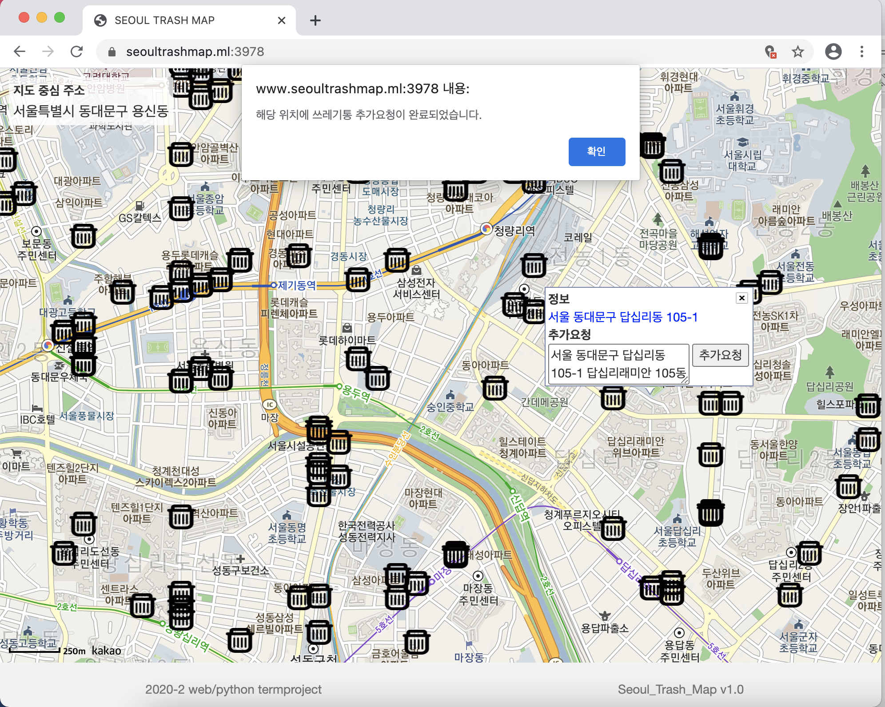
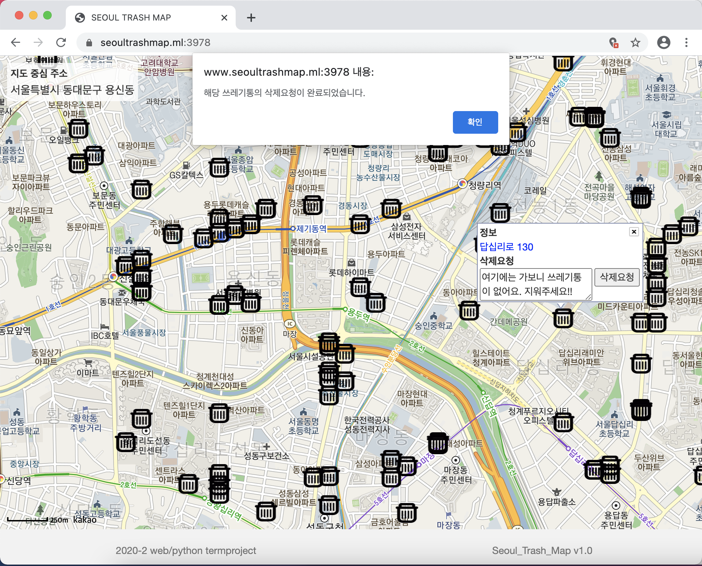
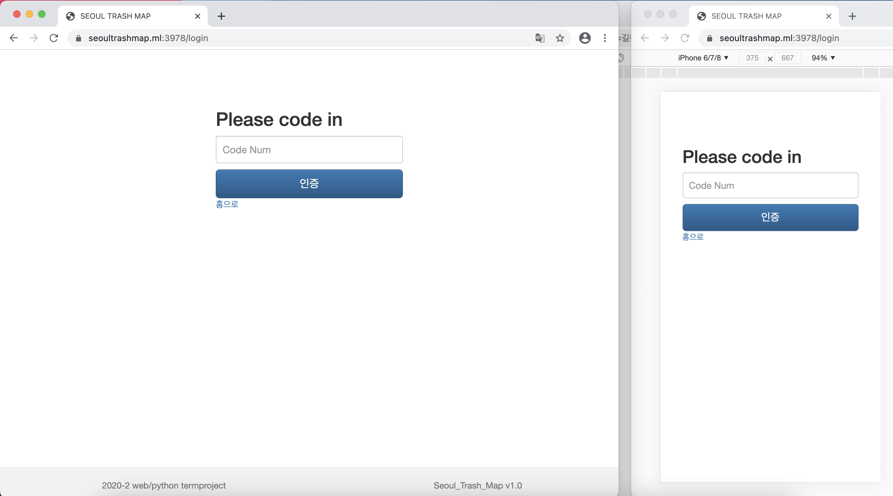
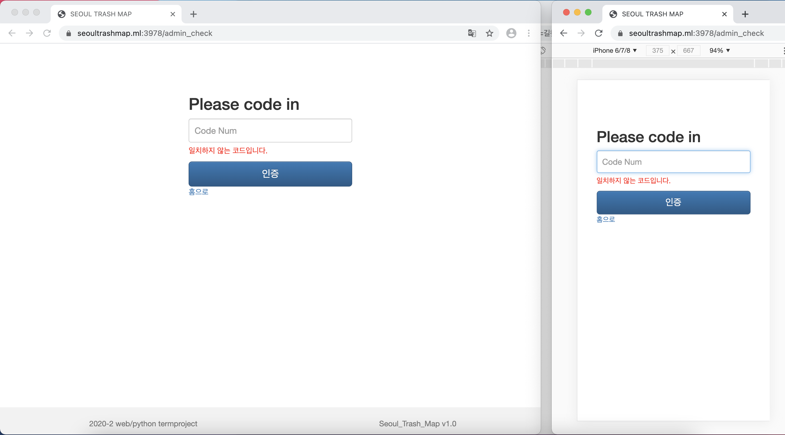
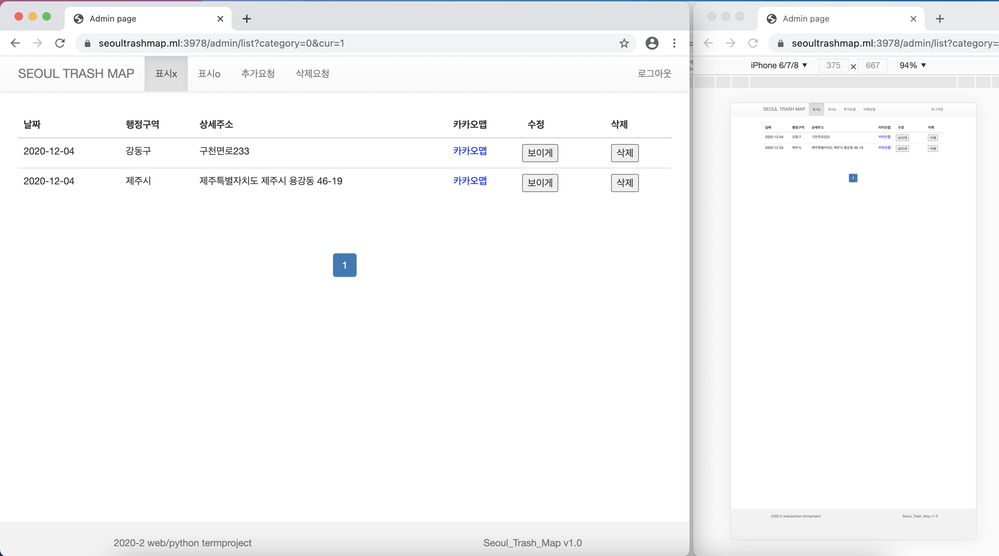
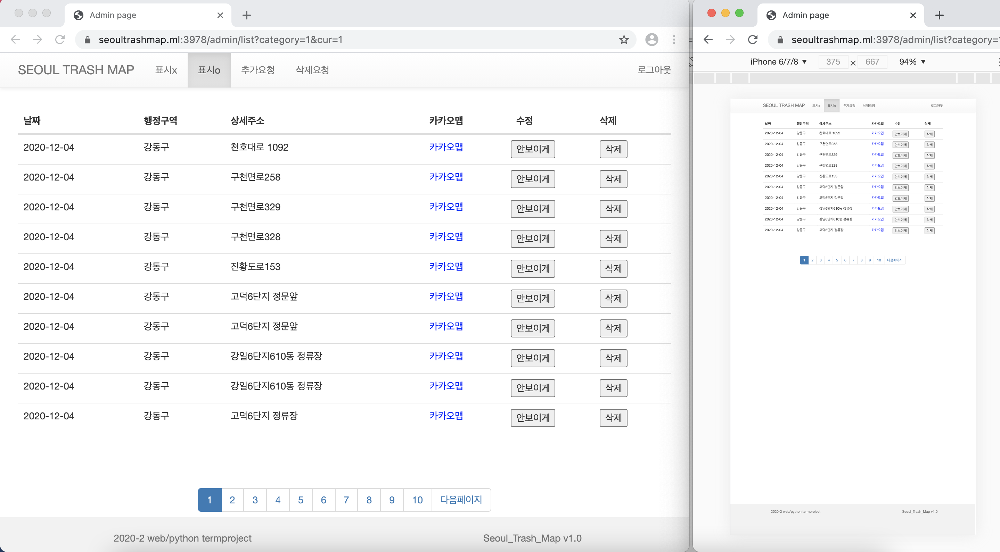
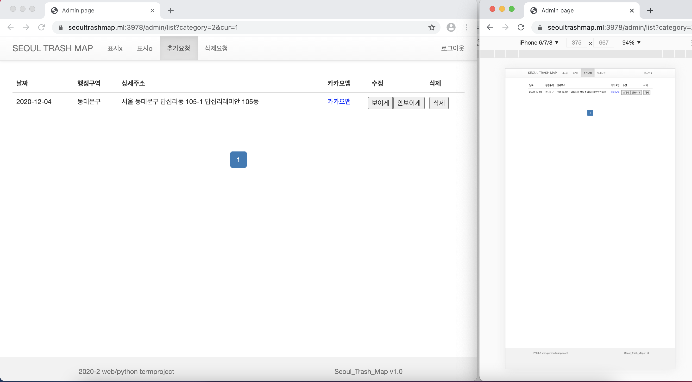
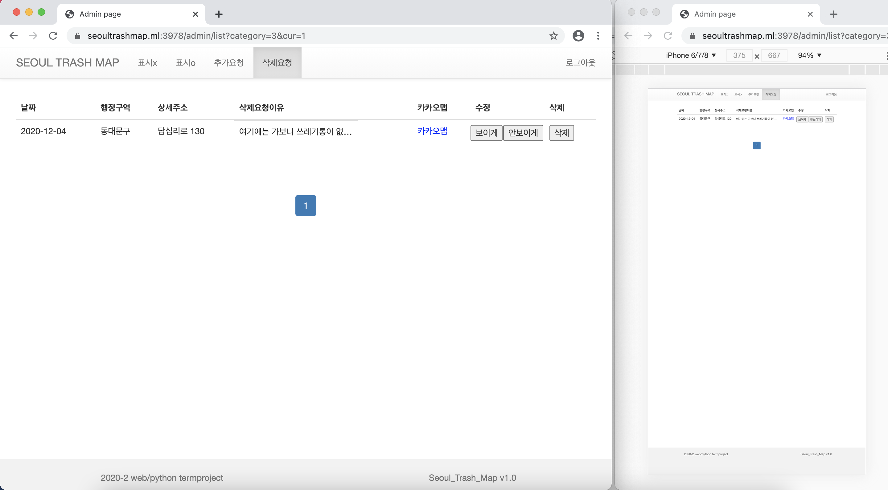

# 서울시 쓰레기통 정보를 지도에 나타내자!

    
## 프로젝트 목표 및 내용

 서울시의 쓰레기통 정보를 바탕으로 지도상에 가로쓰레기통의 위치를 표현한다. 예외로 지도에 표시가 되지 않은 쓰레기통이 존재할 수도 있다. 이에 사용자가 피드백 할 수 있도록, 쓰레기통을 추가로 지도에 표시해달라고 요청하는 기능과 기존의 쓰레기통의 위치가 잘못되었다는 요청을 통해 관리자가 쓰레기통 위치정보를 수정할 수 있는 기능을 추가한다.   
 

## 구현 

### 사용자 

* **메인 화면** : 카카오지도 api를 통해 db에 있는 정보를 바탕으로 지도에 쓰레기통 표시.

* **메인화면-추가요청** : 지도에서 쓰레기통이 아닌 빈공간을 우클릭하면 추가요청을 보낼 수 있는 창이 나온다.(해당창은 지도를 드래그 또는 다른 부분을 클릭하거나 x표시를 눌러서 끌 수 있다.) 이때 기본 주소 뒤에 상세 주소를 적어 추가를 요청할 수 있도록 한다.
  

* **메인화면-삭제요청** : 지도에서 쓰레기통을 우클릭하면 해당 쓰레기통을 삭제해달라는 요청을 보낼 수 있는 창이 나온다.(해당창은 지도를 드래그 또는 다른 부분을 클릭하거나 x표시를 눌러서 끌 수 있다.) 이때 삭제요청 메시지를 적어 삭제 요청을 할 수 있도록 한다. 

 
### 관리자  
* **어드민 접속** : 앞에서 본 지도 상단에 TRASH MAP을 누르면 아래 그림처럼 코드를 입력할 수 있는 페이지로 이동한다. 

    
    
 

 1. **표시X목록** 
     * 
 
 2. **표시O목록** : 
     * 
 
 3. **추가요청, 삭제요청 목록**  
     * 
     * 

## Reference
 
### javascript
 
 * [express](https://github.com/expressjs/express)
 * [express-session](https://github.com/expressjs/session)
 * [mysql](https://github.com/mysqljs/mysql)
 * [body-parser](https://github.com/expressjs/body-parser)
 * [ejs](https://github.com/mde/ejs)
 * [bootstrap](https://github.com/twbs/bootstrap)
 * [jquery](https://github.com/jquery/jquery) 
 
### python
 
 * [requests](https://github.com/psf/requests)
 * [pymysql.cursors](https://github.com/PyMySQL/PyMySQL)
 * [openpyxl](https://openpyxl.readthedocs.io/en/stable/) 
 
### 오픈 api
 
 * [카카오맵api](https://apis.map.kakao.com/)

## 참고자료

 ### 파이썬
 
 * 엑셀파일 읽기
     * https://woolbro.tistory.com/36
    * https://myjamong.tistory.com/51
    * https://doitnow-man.tistory.com/159  
  
 * 카카오맵 api를 이용해 도로명,지번주소를 좌표로 변환
    * https://medium.com/@john_analyst/파이썬을-활용한-카카오-api로-위경도-구하기-69bc51697753
    * https://znznzn.tistory.com/53  
  
 * 카카오맵 api를 이용해 받아온 정보에서 db에 넣을값 찾기(딕셔너리, 리스트 등 자료형에 관해)
    * 딕셔너리
        * https://wikidocs.net/16043
        * https://dojang.io/mod/page/view.php?id=2307
    
    * 리스트
        * https://dojang.io/mod/page/view.php?id=2200
        * http://pythonstudy.xyz/python/article/12-컬렉션--List
    
    * pymysql을 이용해 mysql 테이블에 값 넣기
        * https://yurimkoo.github.io/python/2019/09/14/connect-db-with-python.html
        * http://pythonstudy.xyz/python/article/203
  
### Nodejs
 
 * express 기초(서버열기 및 라우팅)
    * https://opentutorials.org/course/3370 (생활코딩 강의)
    * https://expressjs.com/ko/guide/writing-middleware.html
    * http://junil-hwang.com/blog/nodejs-express/
  
 * express body-parser
    * https://opentutorials.org/course/3370/21397 (생활코딩 강의)
  
 * express mysql
    * https://opentutorials.org/course/3347/21185 (생활코딩 강의)
    * https://singa-korean.tistory.com/31
 
 * nodejs module 만들기
    * https://opentutorials.org/course/3332/21149 (생활코딩 강의)
  
 * 관리자용 테이블 만들기
    * https://abc1211.tistory.com/533
  
 * 카카오맵 api를 활용한 지도 출력하기
 
    * https://apis.map.kakao.com/web/sample/ (주로사용)
    * https://apis.map.kakao.com/web/documentation/ (주로사용)
    * https://kadosholy.tistory.com/2
    * https://goodsharp.tistory.com/589
    * https://velog.io/@mkdevelop5002/공적-마스크-판매처약국-맵-만들기카카오-지도-API사용 (클러스터러 만드는데 큰 도움)
    * https://github.com/i-kay/gmap-convenientsores1/blob/master/app.js
  
 * 삭제, 추가요청 ajax를 활용해 요청하기
    * https://ourcstory.tistory.com/161
    * https://hunjang.tistory.com/5
    * https://gomdoreepooh.github.io/notes/ajax-by-nodejs
  
### CSS

 * css적용하기
    - http://bootstrapk.com (주로사용)
    - https://www.w3schools.com/css/default.asp
    - https://ojji.wayful.com/2014/01/HTML-DIV-to-Float-Three-Divs-side-by-side.html
    - https://webclub.tistory.com/493
  
### AWS 사용하기
 
 * aws 서버 구축 및 도메인 서비스
    * 경희대학교 오픈소스강의 "10주차 Cloud Computing", "11,12주차 Chatbot"참조.

 * aws 내부 mysql
    * https://ndb796.tistory.com/314
    * https://luji.tistory.com/7